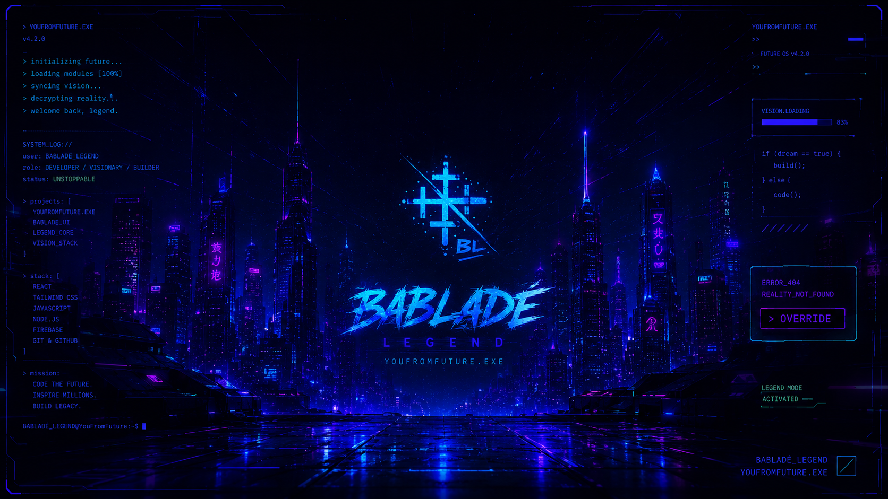

<p align="center">
  
</p>

<h1 align="center">🖤 Bablade Wallpapers</h1>

<p align="center">
A collection of premium wallpapers crafted for the <b>Bablade</b> community.
<br>
Minimal • Cyberpunk • AMOLED • Abstract • Tech • Arch Linux
</p>

---

## 📖 About

Welcome to the official **Bablade Wallpapers** repository.

This repository is home to a growing collection of high-quality wallpapers designed with the Bablade aesthetic in mind. Whether you're customizing your desktop, laptop, or phone, you'll find wallpapers that blend clean design with futuristic and modern themes.

Every wallpaper is created or curated to maintain a premium look while staying true to the Bablade identity.

---

## 📂 Repository Structure

```
Bablade_Wallpapers/
│
├── assets/
│   └── banner.png
│
├── Desktop/
│
└── Mobile/
```

---

## 🖥️ Desktop Wallpapers

Designed for:

- 1920×1080 (Full HD)
- 2560×1440 (QHD)
- 3840×2160 (4K)
- Ultrawide (coming soon)

---

## 📱 Mobile Wallpapers

Optimized for modern smartphones with high-resolution displays.

Perfect for:

- Android
- iPhone
- AMOLED Displays

---

## ✨ Features

- 🎨 High-quality artwork
- 🖤 Clean & minimal designs
- 🌌 Cyberpunk aesthetics
- 💙 Bablade branding
- 📱 Mobile wallpapers
- 🖥️ Desktop wallpapers
- 🚀 Regular updates
- 💯 Free to download

---

## 📥 Download

Clone the repository:

```bash
git clone https://github.com/<your-username>/Bablade_Wallpapers.git
```

Or simply browse the folders and download the wallpapers you like.

---

## 🤝 Contributions

Community contributions are welcome.

If you'd like to contribute a wallpaper:

- Follow the Bablade aesthetic.
- Use high-resolution images.
- Keep designs original or ensure you have permission to share them.
- Submit a Pull Request.

---

## 📜 License

All wallpapers are provided for **personal use** unless stated otherwise.

Please do **not** redistribute, sell, or re-upload the wallpapers without permission.

---

## ⭐ Support

If you enjoy these wallpapers, consider giving the repository a ⭐ on GitHub. It helps others discover the project and supports future releases.

---

<p align="center">
Made by <b>B4lad3_L3gend</b> From <b>Bablade Studios</b>
</p>